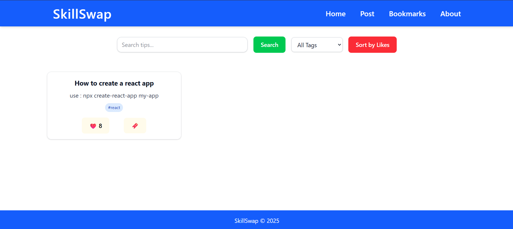
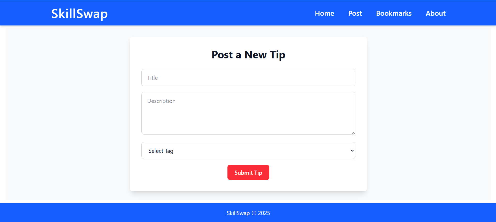
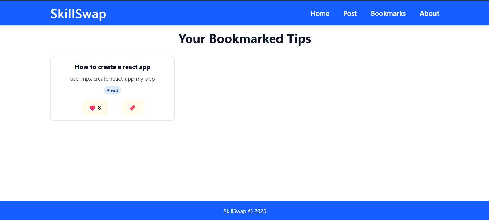
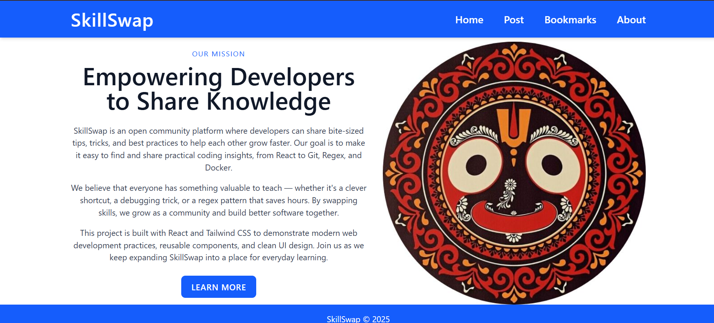

# SkillSwap - Micro Learning Community

SkillSwap is a React-based web application that allows users to **share, browse, like, and bookmark programming tips** in a clean, easy-to-use interface. It is designed to be a micro learning community where developers can quickly find and contribute helpful coding tips categorized by tags.

## Demo

Check out the live demo here: [skill-swap-micro-learning-community.vercel.app](https://skill-swap-micro-learning-community.vercel.app)

---

## Features

- **Add new tips** via a simple form with title, description, and tag.
- **View all tips** on the homepage with instant updates.
- **Like ❤️ and bookmark 🔖 tips**, with counts saved locally for persistence.
- **Search and filter tips** by text and tags for easy navigation.
- **Responsive design** using Tailwind CSS, optimized for both desktop and mobile.
- Data persistence via **LocalStorage**, so tips and user interactions are saved on refresh.
- Routing implemented using React Router for smooth navigation.

---

## Tech Stack

- React.js
- React Router
- Tailwind CSS
- LocalStorage API for data persistence
- Vercel for deployment

---

## Getting Started

### Prerequisites

- Node.js (v14 or above recommended)
- npm or yarn package manager

### Installation

1. Clone the repository:

   ```bash
   git clone https://github.com/Himanshu-xeno/skill-swap.git
   cd skill-swap
   ```

2. Install dependencies:

   ```bash
   npm install
   # or
   yarn install
   ```

3. Start the development server:

   ```bash
   npm start
   # or
   yarn start
   ```

4. Open [http://localhost:3000](http://localhost:3000) in your browser.

---

## Project Structure

```
skill-swap/
├── public/
│   ├── index.html
│   └── tips.json                # Initial tips data
├── src/
│   ├── components/
│   │   ├── Navbar.jsx
│   │   ├── SearchBar.jsx
│   │   ├── TipCard.jsx
│   │   └── TipForm.jsx
│   ├── pages/
│   │   ├── About.jsx
│   │   ├── Bookmarks.jsx
│   │   ├── Home.jsx
│   │   ├── NotFound.jsx
│   │   └── PostTip.jsx
│   ├── App.jsx                  # Main app with routing and state management
│   └── index.js                 # React entry point
├── utils/                       # Helper functions or constants (if any)
├── package.json
├── tailwind.config.js
└── README.md
```

---

## How to Use

- Navigate to the homepage to browse tips.
- Use the search bar and tag filters to find specific tips.
- Click **Post Tip** to add your own programming tip.
- Like or bookmark tips to save your favorites — these states persist thanks to LocalStorage.
- Visit the Bookmarks page to view your saved tips.

---

## Screenshots

_Add screenshots here to showcase the UI_

  
_Home page showing tips grid and search_

  
_Add a new tip with title, description, and tag_

  
_View bookmarked tips_

  
_Learn more about the project and author_

---

## Future Improvements

- Add **Edit** and **Delete** functionalities for full CRUD operations.
- Integrate a backend (e.g., Firebase, Node.js + Express + MongoDB) for centralized data storage.
- Add user authentication for personalized experiences.
- Implement dark mode toggle for better accessibility.
- Improve UI/UX with animations and enhanced accessibility features.

---

## Contributing

Contributions are welcome! Feel free to open issues or submit pull requests to help improve SkillSwap.

---

## License

This project is licensed under the MIT License.

---

## Contact

Created by Himanshu Tiwari — feel free to reach out!

- GitHub: [https://github.com/Himanshu-xeno](https://github.com/Himanshu-xeno)
- LinkedIn: [https://www.linkedin.com/in/himanshu-sk-tiwari](https://www.linkedin.com/in/himanshu-sk-tiwari)

---
